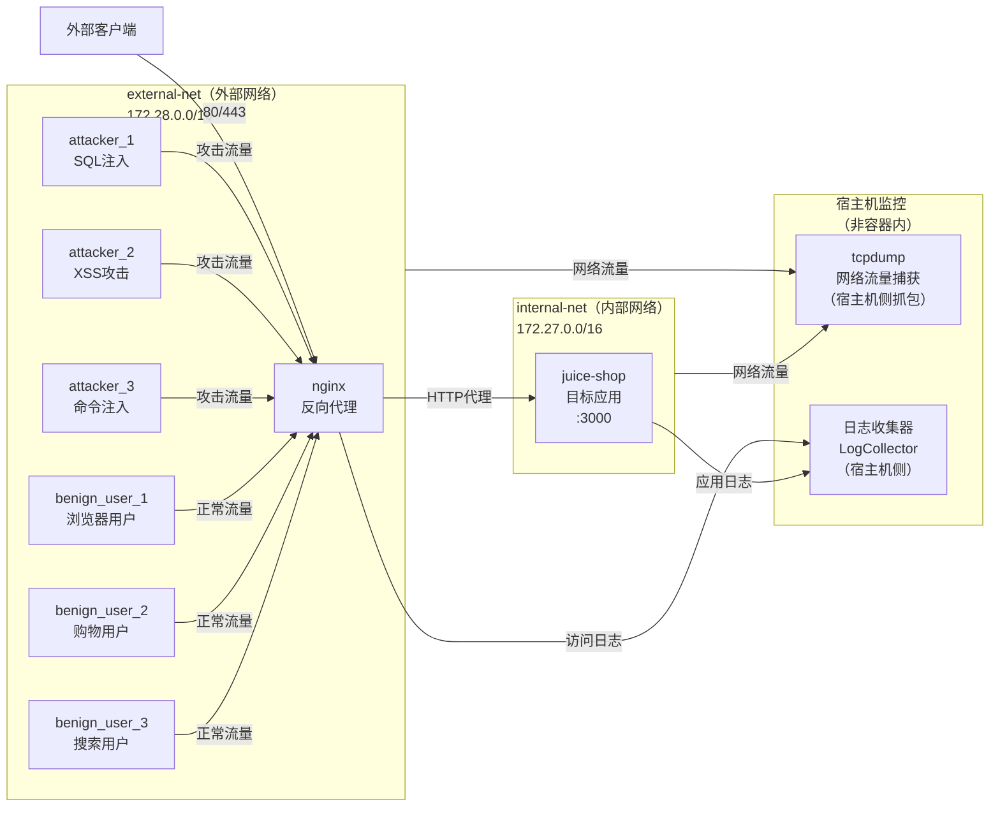
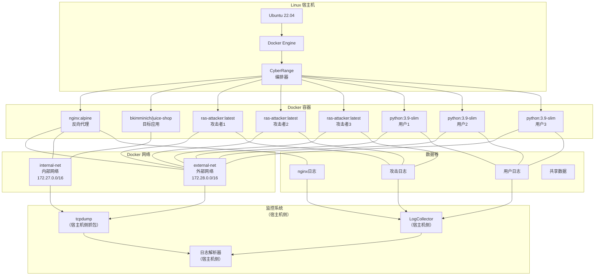
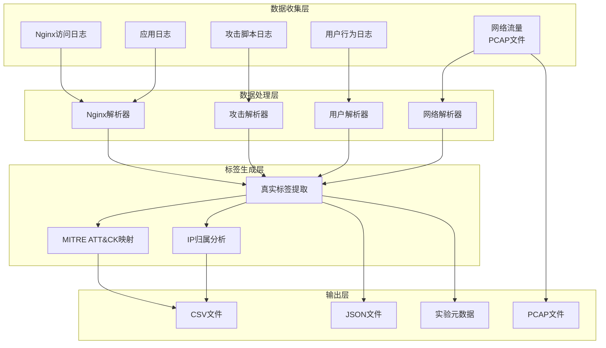

# CyberRange 架构图

## 图1：网络通信架构（修正版）

## 图2：容器化部署架构（修正版）

## 图3：数据流和处理管道

## 使用建议

### 对于Chapter 4，建议使用：

1. **图1（网络通信架构）** - 展示攻击流和正常流的网络路径
2. **图2（容器化部署架构）** - 展示完整的系统架构和组件关系
3. **图3（数据流和处理管道）** - 展示数据处理和标签生成的完整流程

### 每个图的用途：

- **图1**：解释网络隔离和流量路由
- **图2**：解释容器编排和资源管理
- **图3**：解释数据收集和处理流程

这样的三个图能够完整地展示CyberRange系统的技术架构，适合放在Chapter 4中。
